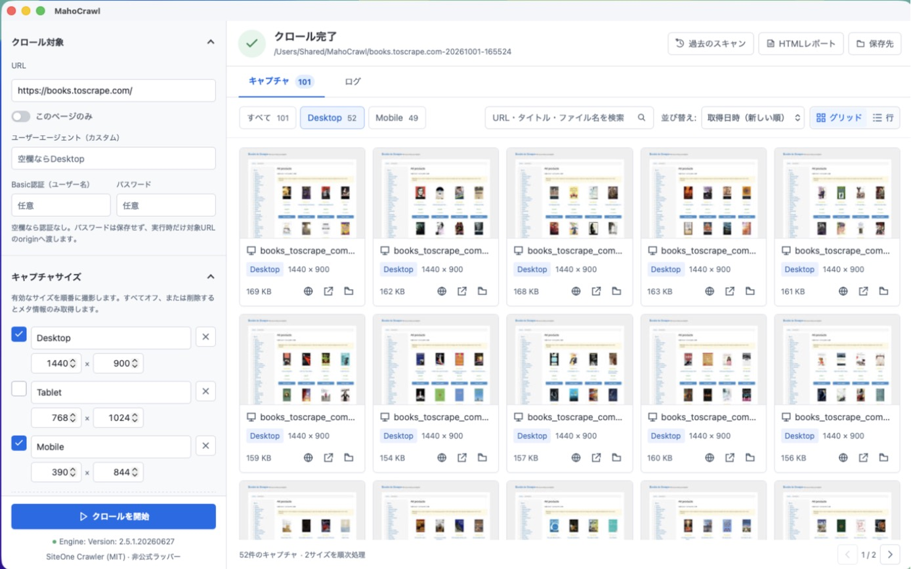
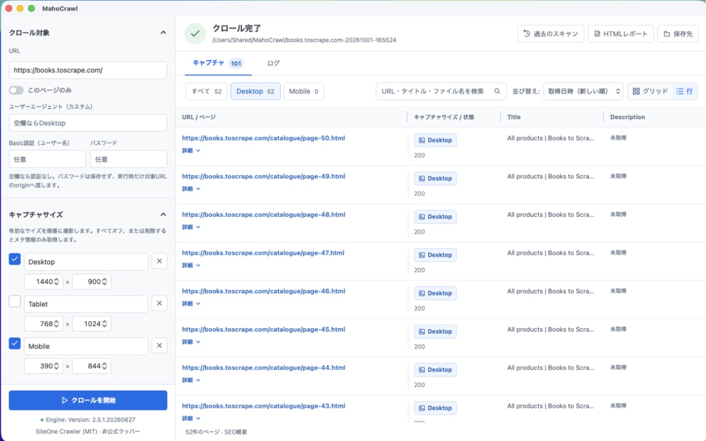

# MahoCrawl

日本語 | [English](README.en.md)

MahoCrawl は、Web サイトをクロールしてページごとのスクリーンショットと SEO 情報をまとめて取得できる macOS / Windows 向けアプリです。Desktop・Tablet・Mobile など複数の画面サイズを1回の実行で順番に撮影し、結果をギャラリーで確認できます。

クロールと撮影には [SiteOne Crawler](https://github.com/janreges/siteone-crawler) を使用しています（アプリに同梱済みのため、別途インストールは不要です）。





## 動作環境

- macOS 13 以降（Apple Silicon（M1 以降）または Intel の Mac）
- Windows 10 / 11（64ビット版）※ベータ版
- Google Chrome などの Chromium 系ブラウザ（スクリーンショット撮影に使用）

## ダウンロードとインストール

[Releases ページ](https://github.com/dtsuka/MahoCrawl/releases/latest)から、お使いのパソコンに合わせてファイルをダウンロードします。

| ファイル | 対象 |
| --- | --- |
| `MahoCrawl_<version>_aarch64.zip` | Apple Silicon（M1 以降）の Mac |
| `MahoCrawl_<version>_x86_64.zip` | Intel の Mac |
| `MahoCrawl_<version>_x64-setup.exe` | Windows（64ビット版） |

### macOS

1. Mac の種類が分からない場合は、メニューバーの Apple メニュー →「この Mac について」の「チップ」（または「プロセッサ」）を確認してください。「Apple M」で始まれば Apple Silicon、「Intel」と書かれていれば Intel です。
2. ダウンロードした zip をダブルクリックして展開します。
3. `MahoCrawl.app` を「アプリケーション」フォルダへ移動します。

MahoCrawl は Apple の Developer ID による署名・公証を行っていないため、初回起動時に「開発元を確認できないため開けません」などの警告が表示されます。次のいずれかの方法で起動してください。

- Finder で `MahoCrawl.app` を右クリック（Control + クリック）し、「開く」を選ぶ
- 一度起動を試みた後、「システム設定」→「プライバシーとセキュリティ」で「このまま開く」を選ぶ

2回目以降は通常どおりダブルクリックで起動できます。

### Windows（ベータ版）

Windows 版はベータ版です。不具合を見つけた場合は [Issues](https://github.com/dtsuka/MahoCrawl/issues) でお知らせください。

1. ダウンロードした `MahoCrawl_<version>_x64-setup.exe` を実行し、画面の案内に従ってインストールします。管理者権限は不要です。
2. インストール後、スタートメニューから MahoCrawl を起動します。

MahoCrawl はコード署名を行っていないため、インストーラーの実行時に「Windows によって PC が保護されました」と表示される場合があります。その場合は「詳細情報」を選び、「実行」をクリックしてください。

## 使い方

### 基本の流れ

1. 左側の「クロール対象」にクロールしたいサイトの URL を入力します。
2. 「クロール設定」で最大深度や同時ワーカー数、リクエスト速度などを調整します。
3. 「キャプチャサイズ」で撮影したい画面サイズをオンにします。
4. クロールを開始すると、有効なサイズを順番に撮影し、結果がギャラリーに表示されます。

設定は入力内容に応じて自動保存されます。

### キャプチャサイズ

デフォルトでは Desktop `1440x900`、Tablet `768x1024`、Mobile `390x844` が用意されています。サイズは追加・削除・オン/オフの切り替えができます。

キャプチャサイズをすべてオフ、または削除してクロールを開始すると、撮影せずに HTML 内のメタ情報（タイトル、description など）だけを取得し、自動的に行表示で結果を表示します。この場合はブラウザを起動しないため、JavaScript によって後から追加される情報は対象外です。

### 結果の確認

- ギャラリーは「グリッド」と「行」を切り替えられます。行表示では1ページを1行で確認できます。
- 検索欄では URL、SEO 項目、ファイル名を検索でき、解除ボタンで条件を戻せます。
- 行のキャプチャサイズ名を選ぶと、そのページ・サイズの画像をプレビューで開きます。プレビューでは「全体」と「100%」を切り替えられ、`Esc` で閉じられます。
- SEO の「詳細」では省略されていないページ情報を確認できます。
- HTML レポートや保存先フォルダもアプリから開けます。

### 過去のスキャン

画面上部の「過去のスキャン」から、現在の保存先にある実行結果を新しい順に確認できます。「開く」を選ぶと、保存済みのキャプチャと SEO 情報を読み込みます。

以前の保存先や外付けディスクに結果がある場合は、「別のフォルダ」から実行フォルダ、または実行フォルダをまとめた親フォルダを指定できます。

### Basic 認証のあるサイト

Basic 認証で保護されたサイトは、ユーザー名とパスワードを入力してクロールできます。パスワードは保存されず、実行時だけ対象 URL と同じ origin にのみ送信されます。アプリを再起動した後は再入力が必要です。

### ブラウザについて

スクリーンショットの撮影には、パソコンにインストールされている Google Chrome などの Chromium 系ブラウザを使用します。自動で見つからない場合は「ブラウザのパス」で指定してください。「見つからない場合に自動取得」をオンにすると、ブラウザが見つからないときに撮影用ブラウザを自動でダウンロードします。

## 保存されるファイル

結果はデフォルトでホームフォルダ内の `Pictures/MahoCrawl/`（macOS では `~/Pictures/MahoCrawl/`、Windows では `C:\Users\<ユーザー名>\Pictures\MahoCrawl\`）に保存されます（保存先は変更できます）。実行ごとに日時入りのフォルダ、キャプチャサイズごとに専用フォルダが作られます。

```text
~/Pictures/MahoCrawl/example.com-20260818-120000/
├── desktop-1440x900/
│   ├── screenshots/
│   ├── report.html
│   ├── report.json
│   └── report.txt
├── tablet-768x1024/
│   └── ...
└── mobile-390x844/
    └── ...
```

メタ情報のみ取得した場合は、実行フォルダ内の `metadata/` にレポートが保存されます。

## ご利用にあたっての注意

- クロール・撮影するサイトは、運営者の許可を得たもの、または利用規約・robots.txt に反しないものに限ってください。
- リクエスト速度や並列数は、対象サイトに過度な負荷をかけない値に設定してください。
- ログやレポートには対象サイトの情報が含まれます。取り扱いにご注意ください。
- Cookie バナーの自動非表示は、同梱の SiteOne Crawler が対応していないため現在は動作しません。

## 開発者向け情報

ソースコードからのビルド方法、開発・テスト、リリース手順は [開発・ビルドガイド](docs/DEVELOPMENT.md) を参照してください。

## ライセンス

MahoCrawl は [MIT License](LICENSE) で公開しています。同梱する SiteOne Crawler（MIT License）を含む第三者ソフトウェアのライセンスは、アプリ内および [`Resources/Licenses/`](Resources/Licenses/) に収録しています。

MahoCrawl は SiteOne Crawler の非公式ラッパーであり、SiteOne Crawler の開発元とは関係ありません。
